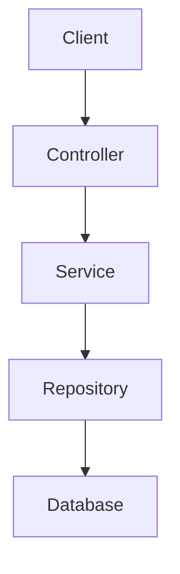

# InteliJ IDEA 프로젝트 생성

![[intellij-create-a-project.png|프로젝트 생성]]

## 언어

세 언어 모두 JVM 언어지만, Spring Boot에서는 주로 Java를 사용하고 최근에는 Null Safety 등의 현대적인 기능이 추가된 Kotlin도 많이 사용한다.

- Java
- Kotlin
- Groovy

## 타입

빌드 도구와 빌드 설정 파일 문법을 선택할 수 있다.

- Gradle - Groovy: Gradle 빌드 도구를 Groovy로 작성한다.
- Gradle - Kotlin: Gradle 빌드 도구를 Kotlin으로 작성한다.
- Maven: 전통적인 빌드 도구로 가독성이 장황하다.

최근에는 Kotlin + Gradle - Kotlin으로 사용한다.

# Spring Boot 프로젝트 구조 살펴보기

```
my-project/
├── src/
│   ├── main/
│   │   ├── java/
│   │   │   └── com/example/myproject/
│   │   │       ├── MyProjectApplication.java
│   │   │       │
│   │   │       ├── controller/
│   │   │       │   └── PostController.java
│   │   │       │
│   │   │       ├── service/
│   │   │       │   └── PostService.java
│   │   │       │
│   │   │       ├── repository/
│   │   │       │   └── PostRepository.java
│   │   │       │
│   │   │       ├── domain/
│   │   │       │   └── Post.java
│   │   │       │
│   │   │       ├── dto/
│   │   │       │   ├── PostRequest.java
│   │   │       │   └── PostResponse.java
│   │   │       │
│   │   │       └── config/
│   │   │           └── SecurityConfig.java
│   │   │
│   │   └── resources/
│   │       ├── application.yml
│   │       ├── static/
│   │       └── templates/
│   │
│   └── test/
│       └── java/
│
├── build.gradle
├── settings.gradle
└── gradlew
```

## 요청 흐름



|     계층      | 책임                      |
| :-----------: | ------------------------- |
|  Controller   | HTTP 요청/응답 처리       |
|    Service    | 비즈니스 로직             |
|  Repository   | 데이터 저장/조회          |
| Domain/Entity | 핵심 데이터와 도메인 규칙 |
|      DTO      | 계층 간 데이터 전달       |
|    Config     | Spring 설정               |

## `MyProjectApplication.java`

> Spring Boot 애플리케이션의 시작점

```java
@SpringBootApplication
public class MyProjectApplication {

    public static void main(String[] args) {
        SpringApplication.run(MyProjectApplication.class, args);
    }
}
```

애플리케이션은 패키지에 위치하고 하위에 다른 계층이 위치한다. `@SpringBootApplication`은 이 패키지와 하위 패키지를 탐색하기 때문이다.

```
com.example
└── myproject
    ├── MyProjectApplication.java
    ├── controller
    ├── service
    └── repository
```

## Controller

> HTTP 요청을 받는 계층

```java
@RestController
@RequestMapping("/posts")
public class PostController {

    private final PostService postService;

    public PostController(PostService postService) {
        this.postService = postService;
    }

    @PostMapping
    public PostResponse createPost(
            @RequestBody PostRequest request
    ) {
        return postService.createPost(request);
    }
}
```

다음과 같은 기능을 수행한다.

- HTTP 요청 받기
- URL 매핑
- Path Variable 처리
- Query Parameter 처리
- Request Body 변환
- HTTP 응답 생성
- 기본적인 Validation

## Service

> 비즈니스 로직을 담당

```java
@Service
public class PostService {

    private final PostRepository postRepository;

    public PostService(PostRepository postRepository) {
        this.postRepository = postRepository;
    }

    public PostResponse createPost(PostRequest request) {

        Post post = new Post(
            request.title(),
            request.content()
        );

        Post savedPost = postRepository.save(post);

        return PostResponse.from(savedPost);
    }
}
```

예를 들어 게시글 작성 규칙에 **제목은 100자를 넘을 수 없다**는 규칙이 있다면 Service나 Domain에 위치하는 것이 적절하다.

```java
if (request.title().length() > 100) {
    throw new IllegalArgumentException("제목이 너무 깁니다.");
}
```

복잡한 도메인 규칙이라면 Entity/Domain 객체 자체가 책임지도록 만드는 것이 더 좋다.

## Repository

> 데이터베이스와 연결되는 계층

Spring Data JPA를 사용하면 간단하게 구현할 수 있다.

```java
public interface PostRepository
        extends JpaRepository<Post, Long> {
}

// 아래와 같은 기능을 제공

postRepository.save(post);

postRepository.findById(id);

postRepository.findAll();

postRepository.delete(post);
```

## Domain / Entity

> 애플리케이션의 핵심 데이터와 도메인을 표현

```java
@Entity
public class Post {

    @Id
    @GeneratedValue
    private Long id;

    private String title;

    private String content;

    // ...
}
```

도메인 로직이 있다면 다음과 같이 객체 내부에 둘 수 있다.

```java
public void changeTitle(String title) {

    if (title == null || title.isBlank()) {
        throw new IllegalArgumentException("제목은 비어 있을 수 없습니다.");
    }

    this.title = title;
}
```

## DTO

> Data Transfer Object로 API의 요청과 응답에 사용하는 객체

```json
// 요청
public record PostRequest(
    String title,
    String content
) {
}

// 응답
public record PostResponse(
    Long id,
    String title,
    String content
) {
}

// Controller에서의 사용
@PostMapping
public PostResponse createPost(
        @RequestBody PostRequest request
) {
    return postService.createPost(request);
}
```

> [!info] Entity를 그대로 반환하지 않는 이유
>
> 다음과 같이 Entity를 그대로 반환하는 것도 가능하다.
>
> ```java
> @PostMapping
> public Post createPost(...) {
>     return postService.createPost(...);
> }
> ```
>
> Entity에는 DB와 관련된 내부 구조가 있을 수 있기 때문에 분리함으로써 API와 DB 모델을 독립적으로 변경할 수 있다.
>
> - Entity <-> Database 구조
> - DTO <-> API 계약

## Config

> Spring의 설정을 담당한다.

```java
@Configuration
public class SecurityConfig {

    @Bean
    SecurityFilterChain securityFilterChain(HttpSecurity http)
            throws Exception {

        return http
            .authorizeHttpRequests(auth -> auth
                .anyRequest().authenticated()
            )
            .build();
    }
}
```

## `resources`

> Java 코드가 아닌 애플리케이션 리소스가 들어간다.

```
src/main/resources/
├── application.yml
├── static/
├── templates/
└── ...
```

## 테스트

```java
class PostServiceTest {

    @Test
    void createPost() {
        ...
    }
}
```

## 계층형 구조의 장점과 단점

가장 일반적인 구조는 다음과 같은 Layered Architecture를 사용한다. 각 레이어의 역할이 명확한 장점이 있지만 프로젝트가 커지면 각 레이어의 파일이 많아져 관리가 어려워진다.

```
com.example.project
├── controller
├── service
├── repository
├── domain
├── dto
└── config
```

> [!tip] Package by Feature
>
> 규모가 커지면 Feature를 기준으로 나누기도 한다.
>
> ```
> com.example.project/
> ├── user/
> │   ├── User.java
> │   ├── UserController.java
> │   ├── UserService.java
> │   ├── UserRepository.java
> │   └── UserResponse.java
> │
> ├── post/
> │   ├── Post.java
> │   ├── PostController.java
> │   ├── PostService.java
> │   ├── PostRepository.java
> │   ├── PostRequest.java
> │   └── PostResponse.java
> │
> ├── comment/
> │   ├── Comment.java
> │   ├── CommentController.java
> │   ├── CommentService.java
> │   └── CommentRepository.java
> │
> └── config/
>     └── SecurityConfig.java
> ```
